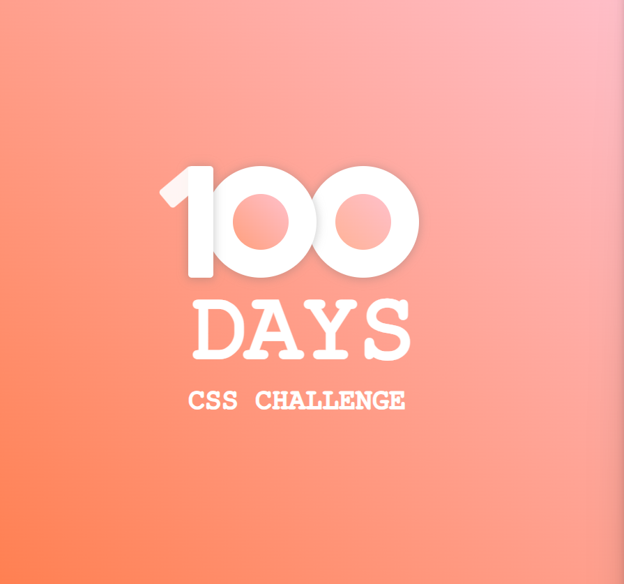

# 100DaysCSSChallenge
### Template
[Link đến Template](https://100dayscss.com/)

## 7. Day 7 - Notifications, Search and Menu
### Result
https://github.com/user-attachments/assets/498a74ce-fdc8-4801-b574-15502f40e072

## 6. Day 6 - Profile
### Result
https://github.com/trieuvy793/100DaysCSSChallenge/assets/93860211/bf3acaf3-bf7d-4ee6-8cf4-67c6d4225790

## 5. Day 5 - Statistic
### Result
https://github.com/trieuvy793/100DaysCSSChallenge/assets/93860211/782e0ee8-0895-4ae5-b9be-d797aa06a212

## 4. Day 4 - Loading
### Result
https://github.com/trieuvy793/100DaysCSSChallenge/assets/93860211/892a5adc-5bbb-4075-8c72-75cab0da6219

## 3. Day 3 - The Pyramid
### Result
https://github.com/trieuvy793/100DaysCSSChallenge/assets/93860211/0254415b-ba8e-422e-b27e-f7079519344e

## 2. Day 2 - Animated menu icon
### Result
https://github.com/trieuvy793/100DaysCSSChallenge/assets/93860211/7b336b07-c623-4654-b2e5-eb8dae779fc8

## 1. Day 1 - Custom build number with gradient
### Result

